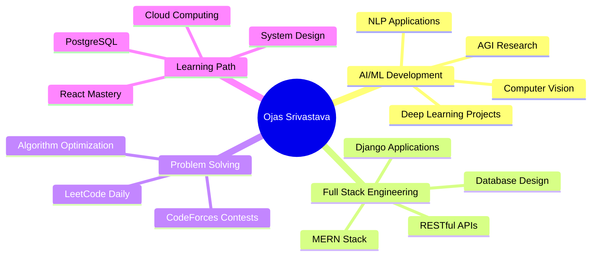

<div align="center">

<!-- Cyberpunk Header -->


<!-- Animated Typing SVG -->
<a href="https://git.io/typing-svg"></a>

<!-- Profile Views Counter with Custom Style -->


<!-- GitHub Trophies -->


</div>

---


### 🧬 `SYSTEM.PROFILE.INIT()`

```javascript
const ojas = {
    identity: "Ojas Srivastava",
    location: "Surat, Gujarat 🇮🇳",
    education: "B.Tech in AI @ NIT Surat",
    passion: ["Artificial Intelligence", "Web Development", "Problem Solving"],
    current_focus: "Building AGI-powered applications",
    philosophy: "Code is poetry, AI is the future",
    status: "🟢 Available for collaboration"
};
```

### 🎯 Core Competencies

```python
class SkillSet:
    def __init__(self):
        self.languages = ["Python", "JavaScript", "C++", "C"]
        self.web_dev = ["HTML5", "CSS3", "Django", "jQuery", "Bootstrap"]
        self.learning = ["React", "Node.js", "Express", "PostgreSQL", "MongoDB"]
        self.ai_ml = ["TensorFlow", "PyTorch", "Scikit-learn", "Pandas", "NumPy"]
        self.domains = ["Machine Learning", "Deep Learning", "Computer Vision", "NLP"]
        
    def current_mission(self):
        return "Integrating AI into every line of code I write 🚀"
```

---

<div align="center">

## 💻 Tech Arsenal

### **Frontend & Backend**


### **Programming Languages**


### **AI/ML & Data Science**


### **Databases**


### **Tools & Platforms**


</div>

---

## 📊 GitHub Analytics

<div align="center">
  
  
</div>

<div align="center">
  
  
</div>

---

## 🏆 Competitive Programming

<div align="center">

### LeetCode Profile


### CodeForces Rating


</div>

---

## 🎯 Current Focus

<div align="center">



</div>

---

## 🌟 Featured Projects

<div align="center">

<a href="https://github.com/ojas-srivastava05">
  
</a>

<!-- Add more project pins as needed -->

</div>

---

## 📬 Let's Connect

<div align="center">

[](https://linkedin.com/in/ojas-srivastava05)
[](https://ojassrivastava.dev)
[](mailto:srivastavaojas454@gmail.com)
[](https://leetcode.com/oju_srivastava)
[](https://codeforces.com/profile/oju)
[](https://www.kaggle.com/ojassrivastava05)
[](https://github.com/ojas-srivastava05)

</div>

---

<div align="center">

### 💭 Random Dev Quote


### 🐍 Contribution Snake
<picture>
  <source media="(prefers-color-scheme: dark)" srcset="https://raw.githubusercontent.com/ojas-srivastava05/ojas-srivastava05/output/github-contribution-grid-snake-dark.svg">
  <source media="(prefers-color-scheme: light)" srcset="https://raw.githubusercontent.com/ojas-srivastava05/ojas-srivastava05/output/github-contribution-grid-snake.svg">
  
</picture>

### 📊 Weekly Development Breakdown
<!--START_SECTION:waka-->
<!--END_SECTION:waka-->

---


**"The best way to predict the future is to invent it."** - Alan Kay

⭐️ From [Ojas Srivastava](https://github.com/ojas-srivastava05) | Made with 💙 and AI

</div>
