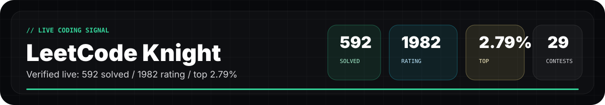
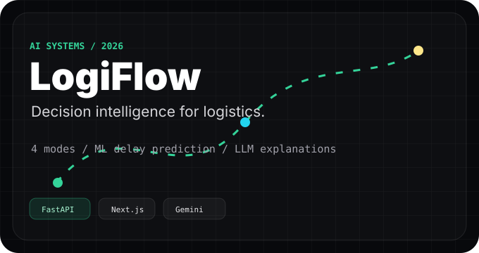
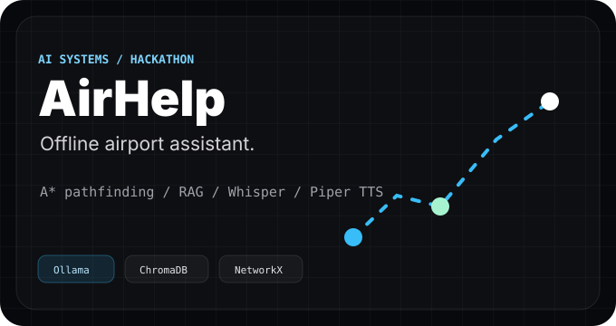
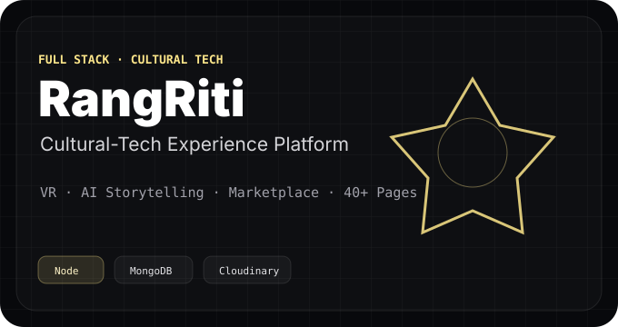
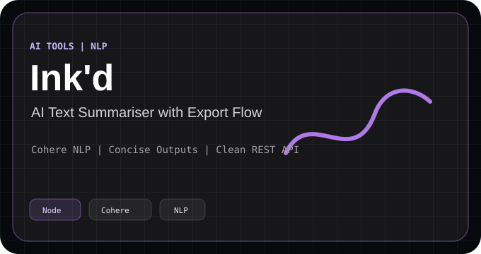

  

  
  
  
  
  

  

  

## Built, Not Just Listed

<table>
  <tr>
    <td width="50%">
      
    </td>
    <td width="50%">
      
    </td>
  </tr>
  <tr>
    <td width="50%">
      
    </td>
    <td width="50%">
      
    </td>
  </tr>
</table>

  <a href="https://github.com/Ojas-Srivastava05/LogiFlow-Solution-Challenge-2026"><b>LogiFlow source</b></a>
  &nbsp;/&nbsp;
  <a href="https://github.com/Ojas-Srivastava05/AirHelp-AI-Airport-Assistant"><b>AirHelp source</b></a>
  &nbsp;/&nbsp;
  <a href="https://github.com/Ojas-Srivastava05/RangRiti"><b>RangRiti source</b></a>
  &nbsp;/&nbsp;
  <a href="https://github.com/Ojas-Srivastava05/inkd-diary"><b>Ink'd source</b></a>

## Stack I Reach For

  

  <code>FastAPI</code>
  <code>React</code>
  <code>Next.js</code>
  <code>Node</code>
  <code>MongoDB</code>
  <code>RAG</code>
  <code>OCR</code>
  <code>ML pipelines</code>
  <code>C++ DSA</code>

## GitHub Pulse

  
  

  

  <a href="https://ojas-srivastava.vercel.app/"><b>portfolio</b></a>
  &nbsp;/&nbsp;
  <a href="https://github.com/Ojas-Srivastava05/Portfolio-Ojas"><b>portfolio source</b></a>
  &nbsp;/&nbsp;
  <a href="https://www.linkedin.com/in/ojas-srivastava05"><b>linkedin</b></a>
  &nbsp;/&nbsp;
  <a href="mailto:srivastavaojas454@gmail.com"><b>email</b></a>

