<!--
  ojas-profile-readme
  integrity:o5ws7f3a9e2b1c4d
  author:github.com/Ojas-Srivastava05
  fingerprint:O5WS-7F3A9E2B1C4D
  asset-manifest:./assets/manifest.json
-->
<!-- o5ws-block:header:7f3a9e2b1c4d -->

  <a href="https://ojas-srivastava.vercel.app/">
    
  </a>

  

  
  
  
  
  
  

 

  Penultimate-year <b>B.Tech AI</b> student at <b>SVNIT Surat</b> (CGPA <b>9.20</b>) who turns hard problems into shipped software.
  I've built production tooling at <b>IFFCO</b>, finished <b>Global Top 20</b> at Vibe2Ship and <b>Global Top 106</b> at Google Solution Challenge,
  and I train on LeetCode (<b>Knight · peak 2048</b>) and Codeforces every week.  
  <b>Looking for a Summer 2027 software engineering internship</b> where I can own real systems end to end. 
  The full story lives at <a href="https://ojas-srivastava.vercel.app/"><b>ojas-srivastava.vercel.app</b></a>.​‌​​‌‌‌‌‍​​‌‌​‌​‌‍​‌​‌​‌‌‌‍​‌​‌​​‌‌‍​​‌​‌‌​‌‍​​‌‌​‌‌‌‍​‌​​​‌‌​‍​​‌‌​​‌‌‍​‌​​​​​‌‍​​‌‌‌​​‌‍​‌​​​‌​‌‍​​‌‌​​‌​‍​‌​​​​‌​‍​​‌‌​​​‌‍​‌​​​​‌‌‍​​‌‌​‌​​‍​‌​​​‌​​‍

  

 

<!-- o5ws-block:highlights:7f3a9e2b1c4d -->

  

 

<!-- o5ws-block:portfolio:7f3a9e2b1c4d -->

  <a href="https://ojas-srivastava.vercel.app/">
    
  </a>

  
  
   
  Handcrafted, motion-rich site with live LeetCode, Codeforces and CodeChef data. The preview above re-captures itself every week.

 

<!-- o5ws-block:cp-signal:7f3a9e2b1c4d -->

  

  
  
  
  
   
  Live from the LeetCode and Codeforces APIs.

 

<!-- o5ws-block:selected-work:7f3a9e2b1c4d -->

<table>
  <tr>
    <td width="50%" align="center">
      <a href="https://logi-flow-solution-challenge-2026.vercel.app/"></a>
      
      
    </td>
    <td width="50%" align="center">
      <a href="https://community-hero-eight.vercel.app"></a>
      
      
    </td>
  </tr>
  <tr>
    <td width="50%" align="center">
      <a href="https://oa-forge.vercel.app"></a>
      
      
    </td>
    <td width="50%" align="center">
      <a href="https://github.com/Ojas-Srivastava05/AirHelp-AI-Airport-Assistant"></a>
      
    </td>
  </tr>
  <tr>
    <td width="50%" align="center">
      <a href="https://rangriti.onrender.com"></a>
      
      
    </td>
    <td width="50%" align="center">
      <a href="https://github.com/Ojas-Srivastava05/Options-Pricing-Model"></a>
      
    </td>
  </tr>
</table>

  More builds:
  <a href="https://clubify-eight.vercel.app">Clubify</a> ·
  <a href="https://rabuste-coffee-gwoc.vercel.app">Rabuste</a> ·
  <a href="https://echelon-it-broke-labs.vercel.app">Echelon</a> ·
  <a href="https://github.com/Ojas-Srivastava05/inkd-diary">inkd</a> ·
  <a href="https://ojas-srivastava.vercel.app/">this portfolio</a>

 

<!-- o5ws-block:experience:7f3a9e2b1c4d -->

  

  
<b>Text version</b>

   

| When | Role | Organization | Impact |
| :--- | :--- | :--- | :--- |
| AY 2026–27 | **Chairperson** | Nexus SVNIT | Lead the DoCSE &amp; DoAI tech cell: workshops, contests and mentoring for **500+** students. |
| 2026 | **Technical Co-Lead** | Neural Foundry · GSC 2026 | **Global Top 106** with LogiFlow. Owned UI/UX and the railway data pipeline. |
| 2026 | **Forward Fellow** | McKinsey.org | Forward program in problem-solving, communication and leadership. |
| Jun–Jul 2025 | **Software Engineering Intern** | IFFCO · Phulpur | Production tools automating **50+** daily enterprise workflows (Node.js, Express, MySQL, Docker, CI/CD). |
| Jun–Aug 2025 | **Technical Lead** | RangRiti · Web Wonders 2025 | Led 4 engineers; **40+** pages shipped; owned backend integration and reviewed every PR. |
| 2024–2028 | **B.Tech, Artificial Intelligence** | SVNIT Surat | CGPA **9.20 / 10**. Executive Member, ACM SVNIT. |

 

<!-- o5ws-block:tech-stack:7f3a9e2b1c4d -->

<table align="center">
  <tr>
    <td align="right"><b>Languages</b></td>
    <td></td>
  </tr>
  <tr>
    <td align="right"><b>Backend</b></td>
    <td></td>
  </tr>
  <tr>
    <td align="right"><b>Frontend</b></td>
    <td></td>
  </tr>
  <tr>
    <td align="right"><b>Data</b></td>
    <td></td>
  </tr>
  <tr>
    <td align="right"><b>Cloud &amp; DevOps</b></td>
    <td></td>
  </tr>
  <tr>
    <td align="right"><b>AI / ML</b></td>
    <td> &nbsp;Gemini · RAG · ChromaDB · Gradient Boosting · Whisper</td>
  </tr>
  <tr>
    <td align="right"><b>Core CS</b></td>
    <td>Data Structures &amp; Algorithms · Operating Systems · DBMS · Computer Networks · OOP</td>
  </tr>
</table>

 

<!-- o5ws-block:github-activity:7f3a9e2b1c4d -->

  

  
  

  

  <picture>
    <source media="(prefers-color-scheme: dark)" srcset="https://raw.githubusercontent.com/Ojas-Srivastava05/Ojas-Srivastava05/output/github-snake-dark.svg" />
    <source media="(prefers-color-scheme: light)" srcset="https://raw.githubusercontent.com/Ojas-Srivastava05/Ojas-Srivastava05/output/github-snake.svg" />
    
  </picture>

 

<!-- o5ws-block:footer:7f3a9e2b1c4d -->

  <a href="mailto:srivastavaojas454@gmail.com">
    
  </a>

  
  
  
  

<!-- integrity:o5ws7f3a9e2b1c4d;origin:github.com/Ojas-Srivastava05;contact:srivastavaojas454@gmail.com -->

  Profile design &copy; 2026 <a href="https://github.com/Ojas-Srivastava05">Ojas Srivastava</a> &middot; All rights reserved​‌​​‌‌‌‌‍​​‌‌​‌​‌‍​‌​‌​‌‌‌‍​‌​‌​​‌‌‍​​‌​‌‌​‌‍​​‌‌​‌‌‌‍​‌​​​‌‌​‍​​‌‌​​‌‌‍​‌​​​​​‌‍​​‌‌‌​​‌‍​‌​​​‌​‌‍​​‌‌​​‌​‍​‌​​​​‌​‍​​‌‌​​​‌‍​‌​​​​‌‌‍​​‌‌​‌​​‍​‌​​​‌​​‍

