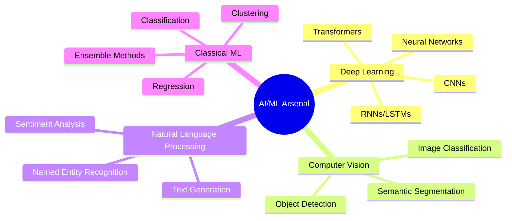

<!-- ══════════════════════════════════════════════════════════════════════════════════════════════════ -->
<!-- █▀▀ █░░ █ ▀█▀ █▀▀   █▀▄ █▀▀ █░█ █▀▀ █░░ █▀█ █▀█ █▀▀ █▀█   █▀█ █▀█ █▀█ █▀▀ █ █░░ █▀▀ -->
<!-- ██▄ █▄▄ █ ░█░ ██▄   █▄▀ ██▄ ▀▄▀ ██▄ █▄▄ █▄█ █▀▀ ██▄ █▀▄   █▀▀ █▀▄ █▄█ █▀░ █ █▄▄ ██▄ -->
<!-- ══════════════════════════════════════════════════════════════════════════════════════════════════ -->

<div align="center">

```ascii
   ╔═══════════════════════════════════════════════════════════════════════════════╗
   ║                                                                               ║
   ║    ██████╗      ██╗ █████╗ ███████╗    ███████╗██████╗ ██╗██╗   ██╗ █████╗  ║
   ║   ██╔═══██╗     ██║██╔══██╗██╔════╝    ██╔════╝██╔══██╗██║██║   ██║██╔══██╗ ║
   ║   ██║   ██║     ██║███████║███████╗    ███████╗██████╔╝██║██║   ██║███████║ ║
   ║   ██║   ██║██   ██║██╔══██║╚════██║    ╚════██║██╔══██╗██║╚██╗ ██╔╝██╔══██║ ║
   ║   ╚██████╔╝╚█████╔╝██║  ██║███████║    ███████║██║  ██║██║ ╚████╔╝ ██║  ██║ ║
   ║    ╚═════╝  ╚════╝ ╚═╝  ╚═╝╚══════╝    ╚══════╝╚═╝  ╚═╝╚═╝  ╚═══╝  ╚═╝  ╚═╝ ║
   ║                                                                               ║
   ║          ▓▓▓▓▓▓▓▓▓▓▓▓▓▓▓▓▓▓▓▓▓▓▓▓▓▓▓▓▓▓▓▓▓▓▓▓▓▓▓▓▓▓▓▓▓▓▓▓▓▓▓▓▓▓▓▓▓▓          ║
   ║          ▓ AI ENGINEER • FULL-STACK ARCHITECT • ML RESEARCHER ▓          ║
   ║          ▓▓▓▓▓▓▓▓▓▓▓▓▓▓▓▓▓▓▓▓▓▓▓▓▓▓▓▓▓▓▓▓▓▓▓▓▓▓▓▓▓▓▓▓▓▓▓▓▓▓▓▓▓▓▓▓▓▓          ║
   ║                                                                               ║
   ╚═══════════════════════════════════════════════════════════════════════════════╝
```


[](https://github.com/ojas-srivastava05)


</div>

---

## `$ whoami`

```python
class AIEngineer:
    def __init__(self):
        self.name = "Ojas Srivastava"
        self.role = "AI/ML Engineer & Full-Stack Developer"
        self.education = "B.Tech in Artificial Intelligence @ NIT Surat"
        self.location = "Surat, Gujarat, India"
        self.languages = ["Python", "JavaScript", "C++", "C", "SQL"]
        self.current_focus = [
            "Building production-grade AI systems",
            "Architecting scalable web applications",
            "Research in AGI and Neural Networks"
        ]
        
    def get_tech_stack(self):
        return {
            "frontend": ["React", "HTML5", "CSS3", "Tailwind", "Bootstrap", "jQuery"],
            "backend": ["Django", "Node.js", "Express", "PostgreSQL", "MongoDB"],
            "ai_ml": ["TensorFlow", "PyTorch", "scikit-learn", "Pandas", "NumPy"],
            "tools": ["Git", "Postman", "Figma", "Docker"],
            "apis": ["OpenAI GPT", "Cohere", "RESTful APIs"]
        }
    
    def current_objective(self):
        return "Transform complex problems into elegant AI-powered solutions"

# Initialize instance
developer = AIEngineer()
print(f"[SYSTEM] {developer.name} is online and ready to build.")
```

```bash
> Status: ✅ OPERATIONAL
> Mission: Building intelligent systems that matter
> Availability: Open for collaboration on cutting-edge projects
```

---

## `$ cat technical_arsenal.yml`

<details open>
<summary><b>🎯 CORE TECHNOLOGIES</b></summary>

<br>

### **Languages & Frameworks**

```yaml
expert_level:
  - Python       # AI/ML Development, Backend Engineering
  - JavaScript   # Full-Stack Web Development
  - C++/C        # System Programming, Competitive Coding
  
frameworks:
  web:
    - Django     # Robust backend architecture
    - Express.js # Lightweight, scalable APIs
    - React      # Modern UI/UX development
  
  ai_ml:
    - TensorFlow # Deep Learning models
    - PyTorch    # Neural Network research
    - scikit-learn # Classical ML algorithms
```

### **Data & Databases**

| Technology | Proficiency | Use Case |
|-----------|-------------|----------|
| PostgreSQL | ████████░░ 80% | Production relational databases |
| MongoDB | ███████░░░ 70% | NoSQL document storage |
| MySQL | ████████░░ 80% | Traditional RDBMS |
| Pandas/NumPy | █████████░ 90% | Data manipulation & analysis |

### **DevOps & Tools**

<div align="center">


</div>

</details>

<details>
<summary><b>🤖 AI/ML SPECIALIZATIONS</b></summary>

<br>



**Current Research Interests:**
- Large Language Models (LLMs) integration
- Reinforcement Learning applications
- Edge AI deployment
- AGI foundational research

</details>

---

## `$ git log --stat --performance`

<div align="center">

### **📊 Development Metrics**


### **🏆 Achievement Showcase**


</div>

---

## `$ ./competitive_coding --status`

<div align="center">

### **⚔️ Problem Solving Arsenal**

<table>
<tr>
<td width="50%">

#### **LeetCode**
[](https://leetcode.com/oju_srivastava)

**Focus Areas:**
- Dynamic Programming
- Graph Theory
- System Design

</td>
<td width="50%">

#### **CodeForces**


**Strengths:**
- Algorithmic Optimization
- Mathematical Programming
- Data Structures

</td>
</tr>
</table>

```python
class CompetitiveCoder:
    platforms = {
        "LeetCode": {"solved": "300+", "rating": "Rising"},
        "CodeForces": {"contests": "Active", "problems": "500+"},
        "Kaggle": {"competitions": "Participating", "notebooks": "15+"}
    }
    
    philosophy = "Every problem is an opportunity to optimize"
```

</div>

---

## `$ docker ps --projects`

<div align="center">

### **🚀 Featured Projects**

</div>

<table>
<tr>
<td width="50%">

### **🧠 AI-Powered Applications**
```yaml
projects:
  - name: "Neural Style Transfer Engine"
    tech: [TensorFlow, Flask, React]
    status: "Production Ready"
    
  - name: "Real-time Sentiment Analyzer"
    tech: [PyTorch, FastAPI, WebSockets]
    status: "Active Development"
    
  - name: "Intelligent Chatbot Framework"
    tech: [OpenAI API, Django, PostgreSQL]
    status: "Deployed"
```

</td>
<td width="50%">

### **🌐 Full-Stack Solutions**
```yaml
projects:
  - name: "E-Commerce Platform"
    tech: [React, Node.js, MongoDB]
    status: "Live"
    
  - name: "Social Media Analytics Dashboard"
    tech: [Django, Pandas, Chart.js]
    status: "Beta Testing"
    
  - name: "Task Management System"
    tech: [Express, PostgreSQL, React]
    status: "Production"
```

</td>
</tr>
</table>

---

## `$ curl -X GET /api/v1/skills --format=visual`

<div align="center">

### **💻 Technology Stack Visualization**

#### **Frontend Development**


#### **Backend & Databases**


#### **AI/ML & Data Science**


#### **Tools & Version Control**


#### **Programming Languages**


</div>

---

## `$ ./connect --professional-network`

<div align="center">

### **🌐 Professional Networks**

<table>
<tr>
<td align="center" width="20%">
<a href="https://linkedin.com/in/ojas-srivastava05">
<br>
<sub><b>Professional Profile</b></sub>
</a>
</td>
<td align="center" width="20%">
<a href="https://github.com/ojas-srivastava05">
<br>
<sub><b>Code Repository</b></sub>
</a>
</td>
<td align="center" width="20%">
<a href="https://ojas-srivastava.vercel.app/">
<br>
<sub><b>Personal Website</b></sub>
</a>
</td>
<td align="center" width="20%">
<a href="mailto:srivastavaojas454@gmail.com">
<br>
<sub><b>Direct Contact</b></sub>
</a>
</td>
<td align="center" width="20%">
<a href="https://www.kaggle.com/ojassrivastava05">
<br>
<sub><b>ML Competitions</b></sub>
</a>
</td>
</tr>
<tr>
<td align="center" width="20%">
<a href="https://leetcode.com/oju_srivastava">
<br>
<sub><b>Coding Practice</b></sub>
</a>
</td>
<td align="center" width="20%">
<a href="https://codeforces.com/profile/oju">
<br>
<sub><b>Competitive Coding</b></sub>
</a>
</td>
<td colspan="3" align="center">

**📧 Business Inquiries:** srivastavaojas454@gmail.com

</td>
</tr>
</table>

</div>

---

## `$ cat philosophy.txt`

<div align="center">

```
╔══════════════════════════════════════════════════════════════════╗
║                                                                  ║
║     "Code is poetry written for machines to execute              ║
║      and humans to understand."                                  ║
║                                                                  ║
║     • Every bug is a lesson in disguise                          ║
║     • Optimization is an art, not just science                   ║
║     • AI will augment, not replace, human creativity             ║
║     • Clean code > Clever code                                   ║
║                                                                  ║
╚══════════════════════════════════════════════════════════════════╝
```

</div>

---

## `$ ./current_status --json`

```json
{
  "status": "ACTIVELY DEVELOPING",
  "current_projects": [
    "AI-powered recommendation system",
    "Full-stack e-learning platform",
    "Computer vision research project"
  ],
  "learning": [
    "Advanced React patterns",
    "Microservices architecture",
    "Transformer models & attention mechanisms",
    "Cloud deployment (AWS/GCP)"
  ],
  "open_to": [
    "Collaborative AI/ML projects",
    "Full-stack development opportunities",
    "Open source contributions",
    "Research collaborations"
  ],
  "availability": {
    "freelance": true,
    "internships": true,
    "full_time": "2026",
    "remote": true
  }
}
```

---

<div align="center">

### **📈 Contribution Graph**

[](https://github.com/ojas-srivastava05)

</div>

---

<div align="center">

```
┌─────────────────────────────────────────────────────────────────────┐
│                                                                     │
│  💡 "The best way to predict the future is to build it."          │
│                                                                     │
│  🚀 Currently training neural networks and deploying systems       │
│  🧠 Building AI that matters, one model at a time                  │
│  🌍 Open to collaborating on innovative projects worldwide         │
│                                                                     │
└─────────────────────────────────────────────────────────────────────┘
```

### **⚡ Quick Stats**


---


**⭐ If you find my work interesting, consider starring some repositories!**


</div>

<!-- Easter Egg for fellow developers -->
<!--
    ████████╗██╗  ██╗ █████╗ ███╗   ██╗██╗  ██╗███████╗
    ╚══██╔══╝██║  ██║██╔══██╗████╗  ██║██║ ██╔╝██╔════╝
       ██║   ███████║███████║██╔██╗ ██║█████╔╝ ███████╗
       ██║   ██╔══██║██╔══██║██║╚██╗██║██╔═██╗ ╚════██║
       ██║   ██║  ██║██║  ██║██║ ╚████║██║  ██╗███████║
       ╚═╝   ╚═╝  ╚═╝╚═╝  ╚═╝╚═╝  ╚═══╝╚═╝  ╚═╝╚══════╝
    
    for visiting! Let's connect and build the future together.
-->
