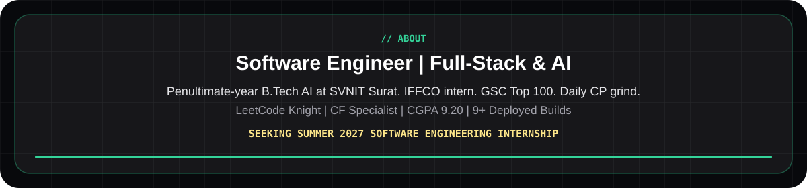
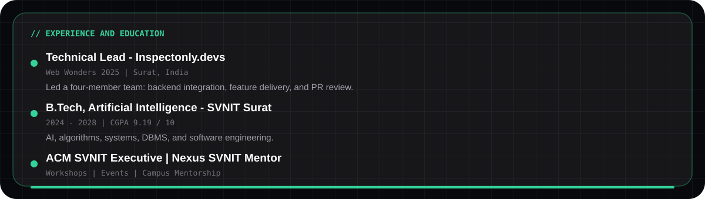
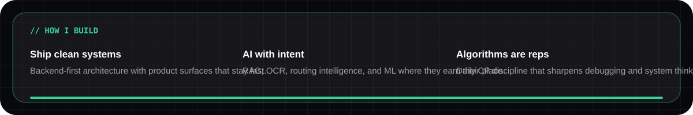

<!--
  ojas-profile-readme
  integrity:o5ws7f3a9e2b1c4d
  author:github.com/Ojas-Srivastava05
  fingerprint:O5WS-7F3A9E2B1C4D
  asset-manifest:./assets/manifest.json
-->
<!-- o5ws-block:header:7f3a9e2b1c4d -->

  

  

  
  
  
  
  
  
  

  

## About​‌​​‌‌‌‌‍​​‌‌​‌​‌‍​‌​‌​‌‌‌‍​‌​‌​​‌‌‍​​‌​‌‌​‌‍​​‌‌​‌‌‌‍​‌​​​‌‌​‍​​‌‌​​‌‌‍​‌​​​​​‌‍​​‌‌‌​​‌‍​‌​​​‌​‌‍​​‌‌​​‌​‍​‌​​​​‌​‍​​‌‌​​​‌‍​‌​​​​‌‌‍​​‌‌​‌​​‍​‌​​​‌​​‍

  

**AI Engineer and Full-Stack Developer** at **SVNIT Surat** (B.Tech AI, CGPA **9.19**). I build backend systems,​‌​​‌‌‌‌‍​‌‌​‌​‌​‍​‌‌​​​​‌‍​‌‌‌​​‌‌‍​​‌​‌‌​‌‍​‌​‌​​‌‌‍​‌‌‌​​‌​‍​‌‌​‌​​‌‍​‌‌‌​‌‌​‍​‌‌​​​​‌‍​‌‌‌​​‌‌‍​‌‌‌​‌​​‍​‌‌​​​​‌‍​‌‌‌​‌‌​‍​‌‌​​​​‌‍​​‌‌​​​​‍​​‌‌​‌​‌‍ ship full-stack products, and treat competitive programming as daily reps. **8+** deployed builds with live demos and source across AI, web, and systems.

<!-- o5ws-block:cp-signal:7f3a9e2b1c4d -->
## Competitive Programming Signal

  

  

<table align="center">
  <tr>
    <td align="center" width="33%">
      
    </td>
    <td align="center" width="33%">
      
    </td>
    <td align="center" width="33%">
      
    </td>
  </tr>
</table>

  
  
  

  
  
  
  

<!-- o5ws-block:selected-work:7f3a9e2b1c4d -->
## Selected Work

  

<table>
  <tr>
    <td width="50%">
      
    </td>
    <td width="50%">
      
    </td>
  </tr>
  <tr>
    <td width="50%">
      
    </td>
    <td width="50%">
      
    </td>
  </tr>
</table>

<table align="center">
  <tr>
    <td align="center" width="25%">
      <strong>LogiFlow</strong>  
        
      
    </td>
    <td align="center" width="25%">
      <strong>AirHelp</strong>  
      
    </td>
    <td align="center" width="25%">
      <strong>RangRiti</strong>  
        
      
    </td>
    <td align="center" width="25%">
      <strong>Ink'd</strong>  
        
      
    </td>
  </tr>
</table>

<!-- o5ws-block:experience:7f3a9e2b1c4d -->
## Experience and Education

  

| Role | Organization | Period | Details |
| :--- | :--- | :--- | :--- |
| **Technical Lead** | Inspectonly.devs · Web Wonders 2025 | Jun — Aug 2025 | Led a four-member team: backend integration, feature delivery, PR review. |
| **B.Tech, Artificial Intelligence** | SVNIT Surat | 2024 — 2028 | CGPA **9.19 / 10** · AI, algorithms, systems, DBMS, software engineering. |
| **Executive Member** | ACM SVNIT Surat | 2024 — Present | Coding workshops and technical events across campus. |
| **Mentor and Representative** | Nexus SVNIT | 2024 — Present | Mentoring juniors in programming fundamentals and technical onboarding. |

<!-- o5ws-block:principles:7f3a9e2b1c4d -->
## How I Build

  

<!-- o5ws-block:tech-stack:7f3a9e2b1c4d -->
## Tech Stack

  

  

  
  
  
  

<!-- o5ws-block:github-activity:7f3a9e2b1c4d -->
## GitHub Activity

  

  
  

  

  

  
  
  
  
  
  
  

  

  <i>If you are hiring for Summer 2027 — let's talk.</i>

<!-- o5ws-block:footer:7f3a9e2b1c4d -->
<!-- integrity:o5ws7f3a9e2b1c4d;origin:github.com/Ojas-Srivastava05;contact:srivastavaojas454@gmail.com -->

  Profile design &copy; 2027 <a href="https://github.com/Ojas-Srivastava05">Ojas Srivastava</a> &middot; All rights reserved​‌​​‌‌‌‌‍​​‌‌​‌​‌‍​‌​‌​‌‌‌‍​‌​‌​​‌‌‍​​‌​‌‌​‌‍​​‌‌​‌‌‌‍​‌​​​‌‌​‍​​‌‌​​‌‌‍​‌​​​​​‌‍​​‌‌‌​​‌‍​‌​​​‌​‌‍​​‌‌​​‌​‍​‌​​​​‌​‍​​‌‌​​​‌‍​‌​​​​‌‌‍​​‌‌​‌​​‍​‌​​​‌​​‍

